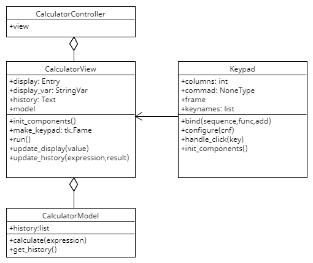

# Calculator

This is a simple calculator application built using Python and Tkinter GUI library in Programming II Course from Kasetsart University. It supports basic arithmetic operations, as well as common mathematical functions such as square root, exponential, natural logarithm, and more.

## Features
- Arithmetic operations: addition, subtraction, multiplication, division
- Common mathematical functions: square root, exponential, natural logarithm, logarithm base 2, logarithm base 10, absolute value
- Memory functionality: store and recall previous calculations
- Error handling: displays an error message for invalid expressions
- Clear functionality: clears the input display

## Installation
To run the calculator, follow these steps:

1. Clone the repository to your local machine:
```git clone https://github.com/Dogoh48/calculator.git```
2. Navigate to the project directory:
```cd calculator```
3. Run the main script:
```python main.py```
4. The calculator application will open, allowing you to perform calculations.

## Usage
- Enter numerical values using the keypad or your keyboard.
- Use the arithmetic operation buttons (+, -, *, /) to perform calculations.
- Use the function buttons (sqrt, exp, ln, log2, log10, abs) to apply common mathematical functions to a value.
- Press DEL to delete the last character or function name.
- Press CLR to clear the input display.
- Press = to evaluate the expression and display the result.


